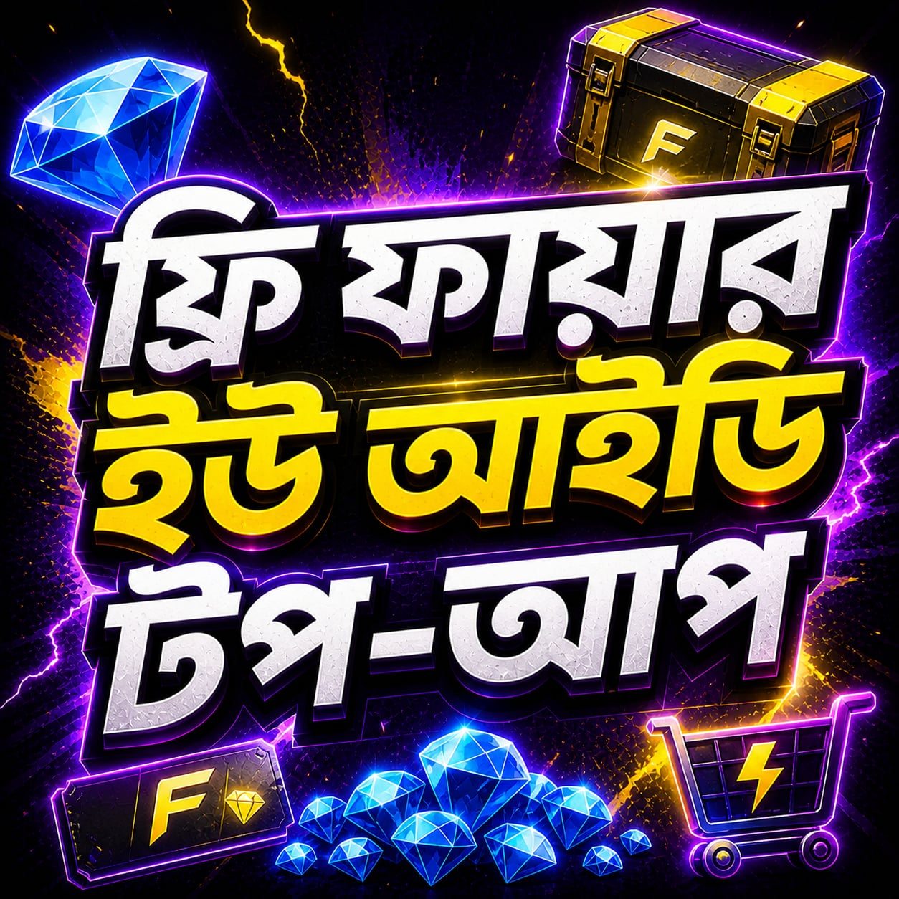

<html lang="en">
<head>
    <meta charset="UTF-8">
    <meta name="viewport" content="width=device-width, initial-scale=1.0, maximum-scale=1.0, user-scalable=no">
    <title>CHOR BAZAR | PREMIUM TOP UP</title>
    <link href="https://fonts.googleapis.com/css2?family=Poppins:wght@500;700;800&family=Rajdhani:wght@500;700&display=swap" rel="stylesheet">
    
</head>
<body onload="startLiveOrderTracking()">

    📢 <b>Notice:</b> মা-বাবা বা পরিবারের কারো ফোন থেকে টাকা চুরি করে কেউ টপআপ করবেন না! যদি করেন সে ক্ষেত্রে তাকে টপআপ দেওয়া হবে না। যেকোনো প্রয়োজন হোয়াটসঅ্যাপে বা টেলিগ্রাম এ যোগাযোগ করুন, ধন্যবাদ।
    &times;

<header>
    
CHOR BAZAR

    <nav>
        <button class="nav-btn" onclick="showPage('home')">Home</button>
        <button class="nav-btn" onclick="showPage('about')">About</button>
        <button class="nav-btn" onclick="showPage('contact')">Contact</button>
    </nav>
</header>

    
🔄 Loading last order details...

    
Select Game / Category

    
    

        

            
            
UID Top Up

        

        

            
            
Membership

        

        

            
            
Evo Access

        

        

            
            
Level Up Pass

        

    

    <button class="back-btn" onclick="showPage('home')">⬅ Back to Categories</button>
    
    

        <h2>1. Player UID</h2>
        <input type="text" id="uid-input" placeholder="Enter Player UID here">
    

    
    

        <h2 id="pack-title">2. Select Recharge</h2>
        

    

    

        <h2>3. Select Payment Method</h2>
        

            

                
            

            

                
                Soon
            

        

    

    
    

        
Total: ৳ 0

        <button class="btn-buy" onclick="openPayment()">BUY NOW</button>
    

    

        
⚠️ Rules & Conditions

        <ul class="rules-list" id="rules-content-list"></ul>
    

    

        <h2>About CHOR BAZAR</h2>
        
Welcome to <b>CHOR BAZAR</b>, your premium destination for instant gaming top-ups. We provide the fastest, safest, and most reliable Weekly and Monthly memberships for your favorite games.

        
Our mission is to ensure a smooth and hassle-free transaction experience so you can focus on your gaming without any interruptions.

        
⚡ 24/7 Support Available

    

    

        <h2>Contact Us</h2>
        
Need help with your order? Feel free to reach out to our dedicated support team anytime through the platforms below:

        <a href="https://wa.me/8801707566410" target="_blank" class="contact-btn whatsapp">💬 Connect via WhatsApp</a>
        <a href="https://t.me/RedRrox" target="_blank" class="contact-btn telegram">✈ Connect via Telegram</a>
    

    

        

        

            <h3 style="font-size: 14px; margin-bottom: 10px;">আপনার বিকাশ নম্বর ও TxID দিন</h3>
            <input type="text" class="trx-input-box" id="customer-phone" placeholder="নম্বরঃ 01XXXXXXXXX" maxlength="11">
            <input type="text" class="trx-input-box" id="trx-input" placeholder="ট্রানজেকশন আইডি দিন" maxlength="10">
            

                ● send money করুনঃ <b>01779772201</b> <button onclick="copyNum()" style="padding:2px 6px; font-size:10px; border-radius:4px; border:none; background:#fff; cursor:pointer;">Copy</button> 
                ● টাকার পরিমাণঃ ৳ <b id="pay-amount">0</b> 
                ⚠️ সতর্কবার্তা: অবশ্যই "Send Money" করতে হবে। মোবাইল রিচার্জ বা ক্যাশআউট করলে পেমেন্ট গ্রহণযোগ্য হবে না!
            

        

        <button class="verify-red-btn" id="verify-btn" onclick="handleRealOrder()">VERIFY PAYMENT</button>
        <button onclick="document.getElementById('bkash-modal').style.display='none'" style="width:100%; background:none; border:none; padding:12px; color:#999; cursor:pointer;">CANCEL</button>
    

    

        
✓

        
আপনার অর্ডারটি সফল হয়েছে!

        
কিছুক্ষণ এর মধ্যে আপনার অর্ডারটি কমপ্লিট হবে।

        
কোনো প্রকার সমস্যা হলে contact করুন।

        <button onclick="closeSuccess()" style="background:var(--purple-main); color:#fff; border:none; padding:13px 40px; border-radius:12px; font-weight:bold; cursor:pointer; width: 100%; margin-top: 20px; font-size: 15px;">ঠিক আছে</button>
    

<footer>
    © 2026 CHOR BAZAR | POWERED BY RRX STUDIOS
</footer>

</body>
</html>
